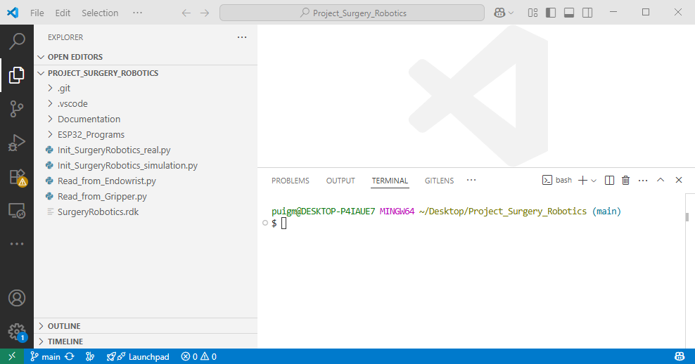

# **Surgery Robotics Project setup**

The objectives of this section are:
- Setup the project in student's github
- Review the needed tools
- Update and syncronize the repository project

## **1. Setup the project in student's github**

When working in Laboratory groups, we suggest you:
- One student plays the role of `Director`. This student makes a "Fork" of the Professor's github project.
- The `Director` accept the other students as `Collaborators`

- Then the `Collaborators` will make a "fork" of the `Director`'s github project.
- The `Collaborators` will be able to update the github `Director`'s project and participate on the project generation

To work on the project (during lab sessions or for homework at home), the `Director` or `Collaborators` have to clone the `Director`'s github project in Visual Studio Code local environment.
- Open VScode on lab's PC, go to Desktop folder and clone the `Director`'s github project.

- In VScode open the folder you have cloned to work on the project



## **2. Review the needed tools**

When

## **3. Update and syncronize the repository project**

When working on a Laboratory project, the objective at the end of a Lab session is to update the changes you have made. This can be made either by the `Project-Director` of the Lab group or by any other `Collaborator` following the procedure:
- First time on the TheConstruct environment, you have to clone the `Project-Director` github project:
  ````shell
  git clone https://github.com/Director_user_name/ROS2_rUBot_mecanum_ws.git
  ````
- Next times, the project ws will be already in the TheConstruct environment. Now you have to access to the TheConstruct environment local repository:
  ````shell
  cd /home/user/ROS2_rUBot_mecanum_ws
  ````
- Update the local repository with possible changes in github origin repository
  ````shell
  git pull
  ````
- You can work with your local repository for the speciffic project session
- Once you have finished and you want to syncronize the changes you have made and update the github origin repository, type:
  ````shell
  git add .
  git commit -m "Message"
  ````
- When you will Push them, the first time you will be asked to link the repository to your github account:
- Open a terminal in and type the first time:
  ```shell
  git config --global user.email "manel.puig@ub.edu"
  git config --global user.name "manelpuig"
  git commit -m "Message"
  git push
  ```
  > change the email and username and message
- You will have to specify your Username and Password (Personal Access Token you have generated)

To obtain the **PAT** in github follow the instructions:

  - Log in to GitHub
  - Click on your profile picture and select `settings`
  - Select `Developer Settings`
  - Select Access Personal Access Tokens: Choose Tokens (classic)
  - Click Generate new token (classic) and configure it:
    - Add a note to describe the purpose of the token, e.g., "ROS repo sync."
    - Set the expiration (e.g., 30 days, 60 days, or no expiration).
    - Under Scopes, select the permissions required:
      - For repository sync, you usually need: repo (full control of private repositories)
    - Click Generate token
  - Once the token is generated, copy it immediately. You won't be able to see it again after leaving the page.

The `Project-Director` github repository has been updated!